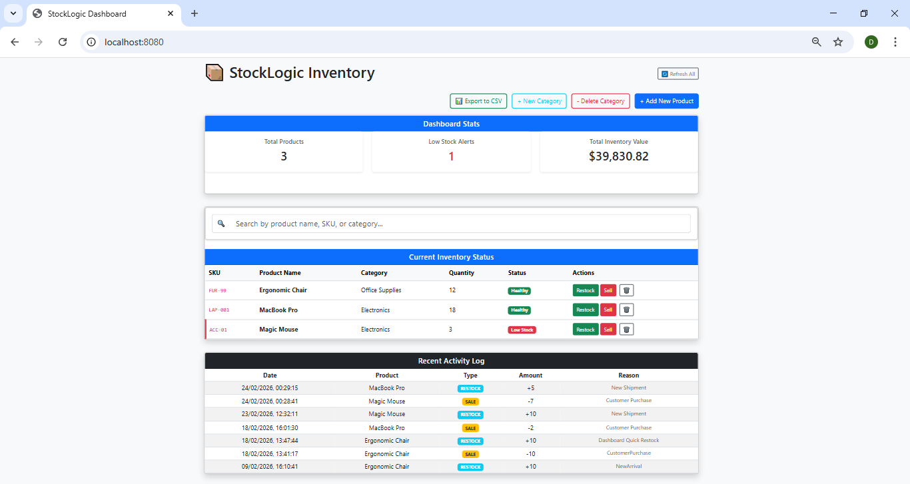
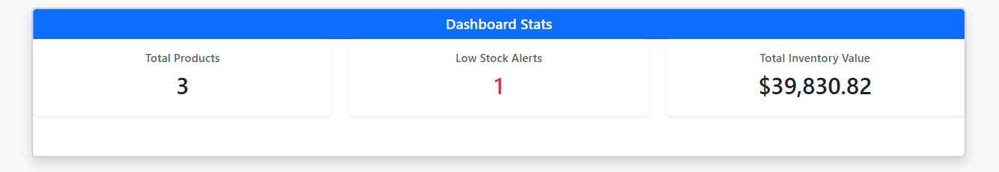
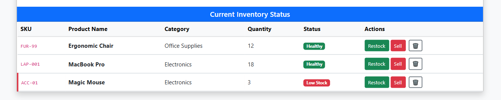
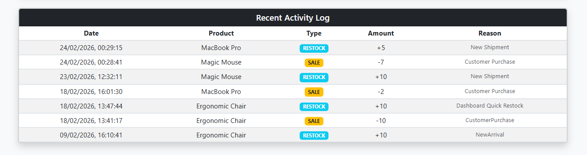
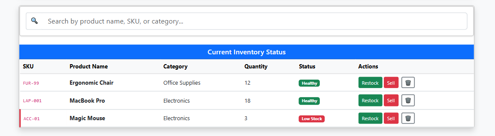
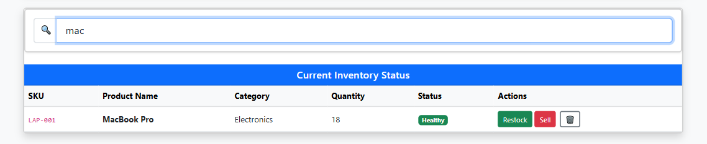

# 📦 StockLogic Inventory Management System

StockLogic is a full-stack inventory management solution designed for real-time tracking, auditing, and reporting. Built with **Spring Boot**, **PostgreSQL**, and **Vanilla JavaScript**, it demonstrates a robust approach to handling complex data relationships and business logic.

## 🚀 Key Features

- **Dynamic Dashboard**: Real-time visualization of Total Products, Low Stock Alerts, and Total Inventory Valuation.
- **Smart Search & Filtering**: Instant, client-side search functionality allowing users to filter by SKU, Name, or Category without page reloads.
- **Advanced Category Management**:
    - Dynamic category creation with descriptions.
    - **Safe Deletion Logic**: Built-in referential integrity checks that prevent deleting categories currently linked to active products.
- **Audit Logging**: A dedicated "Recent Activity Log" that tracks every stock movement (Sales vs. Restocks) with timestamps and custom reasons.
- **Data Portability**: Integrated "Export to CSV" feature for external reporting and inventory auditing.
- **Responsive UI**: A three-tier dashboard layout (Stats, Inventory, Activity) built with Bootstrap 5.

## 🏗️ Architecture (The "Golden Thread")

The project follows a professional **Layered Architecture** to ensure code maintainability:
- **Controller (The Waiter)**: Handles REST API requests and manages communication between the user and the backend.
- **Service (The Chef/Brain)**: Processes business logic, such as calculating stock changes and enforcing data safety rules.
- **Repository (The Pantry)**: Manages direct communication with the PostgreSQL database using Spring Data JPA.
- **Model (The Recipe)**: Defines the data structure for Products, Categories, and Transactions.

## 🛠️ Tech Stack

- **Backend**: Java 17+, Spring Boot 3.x, Spring Data JPA
- **Database**: PostgreSQL (Relational)
- **Frontend**: JavaScript (ES6+), HTML5, CSS3, Bootstrap 5
- **Build Tool**: Maven

## 📸 Screenshots

### Dashboard Overview


### Dashboard Stats


### Inventory Table


### Recent Activity Log


### Search (Default View)


### Search (Filtered Result)


## 🚦 Getting Started

### Prerequisites

- JDK 17 or higher
- PostgreSQL
- Maven

### Installation & Setup

1. Clone the repository:

```bash
git clone https://github.com/DikshaBhagat11/stocklogic-inventory-system.git
```

2. Database Setup

- Create a PostgreSQL database named `stocklogic_inventory`.
- Update `src/main/resources/application.properties` with your database credentials:

```properties
spring.application.name=StockLogic Dashboard
spring.datasource.url=jdbc:postgresql://localhost:5432/stocklogic_inventory
spring.datasource.username=your_username
spring.datasource.password=your_password
```

3. Run the Application

- Open the project in your IDE (IntelliJ/Eclipse).

**Option 1:**
Run the `InventoryApplication.java` file.

**Option 2:**
Use the terminal:

```bash
mvn spring-boot:run
```

4. Access the Portal

Navigate to:

```
http://localhost:8080
```

## 📈 Database Schema

The system utilizes three primary entities:

- **Product**: Core inventory items.
- **Category**: Organizational groupings with strict referential integrity.
- **StockTransaction**: A dedicated audit table for tracking quantity changes over time.

## 🗺️ Future Roadmap

- [ ] **Spring Security**: Implementing a role-based login layer (Admin vs. Staff).
- [ ] **Data Visualization**: Adding Chart.js for monthly stock trend analysis.
- [ ] **Email Alerts**: Automated notifications when items hit "Low Stock" levels.

Created by Diksha Bhagat - 2026